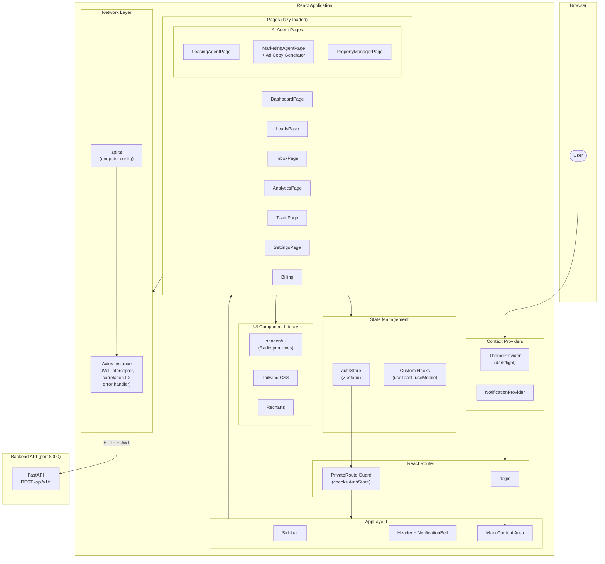

# Loriaa AI CRM — Frontend

React + TypeScript frontend for the Loriaa AI property management CRM, featuring AI agent dashboards, voice bot management, ad copy generation, and a full-featured CRM interface.

## Tech Stack

| Layer | Technology |
|-------|-----------|
| Framework | React 18 + TypeScript |
| Build Tool | Vite 6 |
| Styling | Tailwind CSS 3.4 + tailwindcss-animate |
| UI Components | Radix UI primitives + shadcn/ui |
| State | Zustand |
| HTTP Client | Axios |
| Routing | React Router 6 |
| Charts | Recharts |
| Testing | Vitest + Testing Library + MSW |

## Overall Architecture



> **See also:** [SEQUENCE_DIAGRAM.md](SEQUENCE_DIAGRAM.md) for detailed flow diagrams of every user interaction.

## Prerequisites

### Required Software

| Software | Version | Download |
|----------|---------|----------|
| Git | 2.40+ | https://git-scm.com/downloads |
| Node.js | 20 LTS | https://nodejs.org/ |
| Yarn | 1.22+ | https://classic.yarnpkg.com/en/docs/install |
| Docker Desktop | 4.x+ (optional, for full-stack) | https://www.docker.com/products/docker-desktop/ |
| GitHub Desktop (optional) | Latest | https://desktop.github.com/ |

### Installation — Windows

1. **Git**
   - Download the installer from https://git-scm.com/downloads/win
   - Run the `.exe` and follow the wizard (defaults are fine)
   - Verify: open **PowerShell** and run:
     ```powershell
     git --version
     ```

2. **Node.js 20 LTS**
   - Download the LTS installer from https://nodejs.org/
   - Run the `.msi` and follow the wizard
   - Verify:
     ```powershell
     node --version
     npm --version
     ```

3. **Yarn**
   - After Node.js is installed:
     ```powershell
     npm install -g yarn
     yarn --version
     ```

4. **Docker Desktop (optional — needed only to run the full stack)**
   - Download from https://www.docker.com/products/docker-desktop/
   - Run the installer — enable **WSL 2 backend** when prompted
   - Restart your PC if asked
   - Launch Docker Desktop and wait for the whale icon to become steady
   - Verify:
     ```powershell
     docker --version
     docker compose version
     ```

5. **GitHub Desktop (optional)**
   - Download from https://desktop.github.com/
   - Sign in with your GitHub account

### Installation — macOS

1. **Homebrew** (package manager — install first if you don't have it)
   ```bash
   /bin/bash -c "$(curl -fsSL https://raw.githubusercontent.com/Homebrew/install/HEAD/install.sh)"
   ```

2. **Git** (comes with Xcode CLT, or install via Homebrew)
   ```bash
   xcode-select --install   # easiest option
   # or
   brew install git
   git --version
   ```

3. **Node.js 20 LTS**
   ```bash
   brew install node@20
   node --version
   npm --version
   ```

4. **Yarn**
   ```bash
   npm install -g yarn
   yarn --version
   ```

5. **Docker Desktop (optional)**
   - Download the `.dmg` from https://www.docker.com/products/docker-desktop/
   - Drag to Applications, launch, and grant permissions
   - Verify:
     ```bash
     docker --version
     docker compose version
     ```

6. **GitHub Desktop (optional)**
   - Download from https://desktop.github.com/

### Clone the Repositories

Using the command line:

```bash
# Create a project folder
mkdir ~/loriaa && cd ~/loriaa    # macOS / Linux
mkdir D:\loriaa && cd D:\loriaa   # Windows PowerShell

# Clone both repos side by side
git clone https://github.com/napandya/revised-loriaa-backend.git
git clone https://github.com/napandya/revised-loriaa-frontend.git
```

Or using **GitHub Desktop**: click **File → Clone Repository**, search for `napandya/revised-loriaa-backend` and `napandya/revised-loriaa-frontend`, and clone them into the same parent folder.

Your folder structure should look like:

```
loriaa/
├── revised-loriaa-backend/
└── revised-loriaa-frontend/
```

> **Important:** Both repos must sit side by side in the same parent directory. The `docker-compose.yml` in the backend repo references `../revised-loriaa-frontend` for the frontend build.

---

## Quick Start (Standalone)

```bash
cd revised-loriaa-frontend

# Install dependencies
yarn install

# Start development server
yarn start          # http://localhost:3000
# or
yarn dev            # http://localhost:5173

# Build for production
yarn build

# Run tests
yarn test
```

> The frontend needs the backend API running to function fully. Set the `VITE_BACKEND_URL` environment variable if the backend is on a non-default URL.

## Quick Start (Full Stack with Docker)

Run everything from the backend repo:

```bash
cd revised-loriaa-backend

# 1. Copy and configure environment
cp .env.example .env          # macOS / Linux
copy .env.example .env        # Windows CMD

# 2. Start all services (backend + frontend + db + redis)
docker compose up -d
```

Frontend will be available at http://localhost:3000.

## Pages

| Page | Route | Description |
|------|-------|-------------|
| Login | `/login` | Authentication |
| Dashboard | `/` | Overview metrics, charts, KPIs |
| Bots | `/bots` | Voice bot management |
| Call Logs | `/call-logs` | Call history and details |
| Leads | `/leads` | CRM lead pipeline |
| Inbox | `/inbox` | Unified multi-channel inbox |
| Analytics | `/analytics` | Performance analytics and charts |
| Team | `/team` | Team member management |
| Billing | `/billing` | Usage and billing overview |
| Settings | `/settings` | Profile, notifications, integrations |

### AI Agent Pages

| Page | Route | Description |
|------|-------|-------------|
| Leasing Agent | `/agents/leasing` | Lead qualification and tour scheduling |
| Marketing Agent | `/agents/marketing` | Campaign analysis + AI ad copy generator |
| Property Manager | `/agents/property` | Document Q&A and policy lookup |

## Project Structure

```
src/
├── App.tsx                    # Root component with routing
├── index.tsx                  # Entry point
├── index.css                  # Global styles (Tailwind)
├── components/
│   ├── ui/                    # shadcn/ui base components
│   ├── common/                # Shared components
│   ├── layout/                # Layout (sidebar, header)
│   ├── leads/                 # Lead-specific components
│   ├── team/                  # Team-specific components
│   ├── Header.tsx
│   ├── Sidebar.tsx
│   ├── Overview.tsx
│   ├── BotsList.tsx
│   ├── BotDetail.tsx
│   ├── CallLogs.tsx
│   ├── Billing.tsx
│   ├── Teams.tsx
│   ├── AnalyticsChart.tsx
│   ├── MetricCard.tsx
│   ├── NotificationBell.tsx
│   └── ErrorBoundary.tsx
├── pages/
│   ├── DashboardPage.tsx
│   ├── AuthPage.tsx
│   ├── Login.tsx
│   ├── LeadsPage.tsx
│   ├── InboxPage.tsx
│   ├── AnalyticsPage.tsx
│   ├── TeamPage.tsx
│   ├── SettingsPage.tsx
│   ├── Billing.tsx
│   └── agents/
│       ├── LeasingAgentPage.tsx
│       ├── MarketingAgentPage.tsx   # Includes AI Ad Copy Generator
│       └── PropertyManagerPage.tsx
├── config/
│   └── api.ts                 # API endpoint configuration
├── contexts/
│   ├── NotificationContext.tsx
│   └── ThemeContext.tsx
├── hooks/
│   ├── use-mobile.ts
│   └── use-toast.ts
├── lib/
│   ├── axios.ts               # Axios instance with interceptors
│   ├── errorHandler.ts        # Global error handling
│   ├── logger.ts              # Client-side logging
│   └── utils.ts               # Utility functions (cn, etc.)
├── services/                  # API service layer
├── stores/                    # Zustand stores
├── types/                     # TypeScript type definitions
└── test/                      # Test setup and mocks
```

## Scripts

| Command | Description |
|---------|-------------|
| `yarn start` | Dev server on port 3000 |
| `yarn dev` | Dev server on default Vite port |
| `yarn build` | Production build |
| `yarn test` | Run tests |
| `yarn test:ui` | Tests with Vitest UI |
| `yarn test:coverage` | Tests with coverage report |
| `yarn test:watch` | Tests in watch mode |

## Configuration

- [vite.config.ts](vite.config.ts) — Vite build config with path aliases
- [tailwind.config.js](tailwind.config.js) — Tailwind theme and plugins
- [tsconfig.json](tsconfig.json) — TypeScript compiler options
- [components.json](components.json) — shadcn/ui component config

Path alias `@/` maps to `src/` for clean imports:

```typescript
import { Button } from "@/components/ui/button";
```

## Environment Variables

| Variable | Description |
|----------|-------------|
| `VITE_BACKEND_URL` | Backend API URL (default: `http://localhost:8000`) |

## License

MIT
