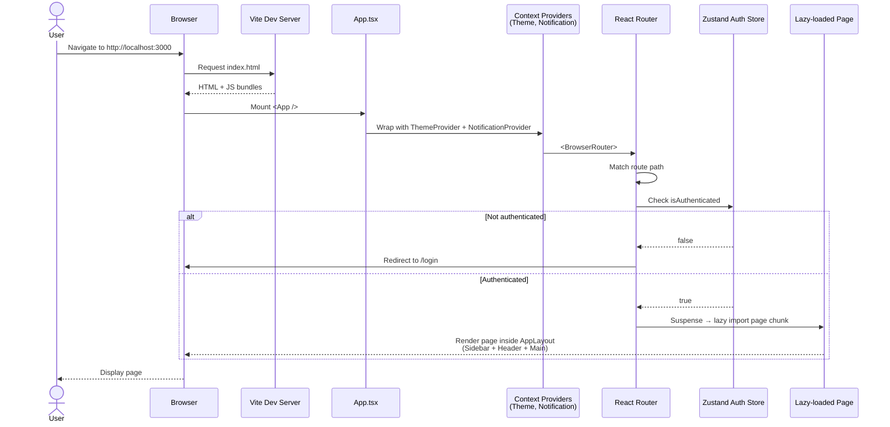
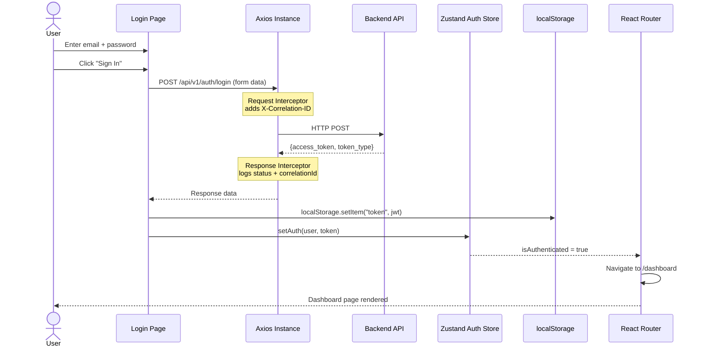
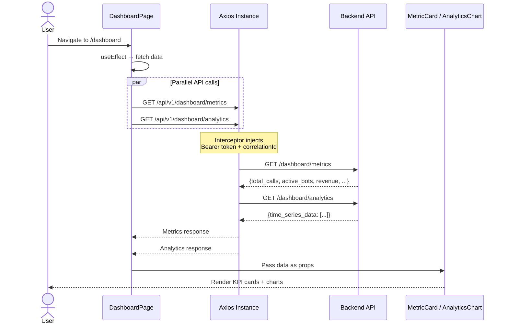
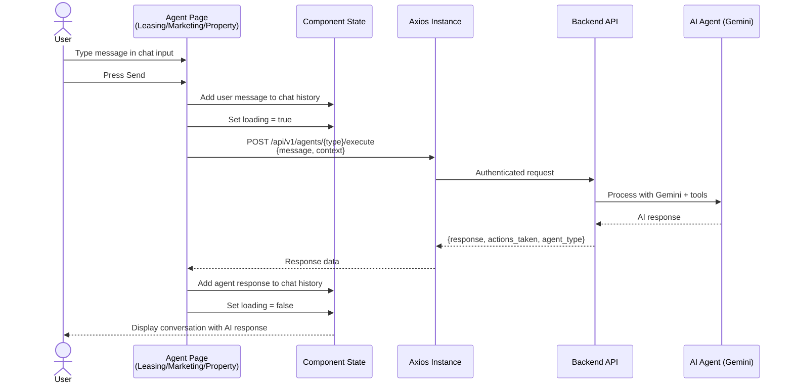
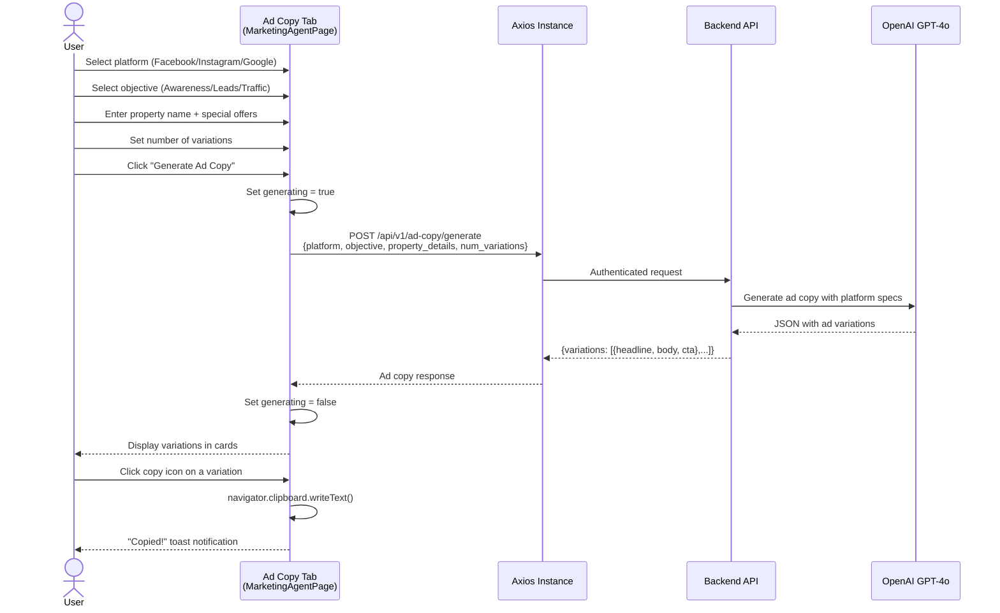
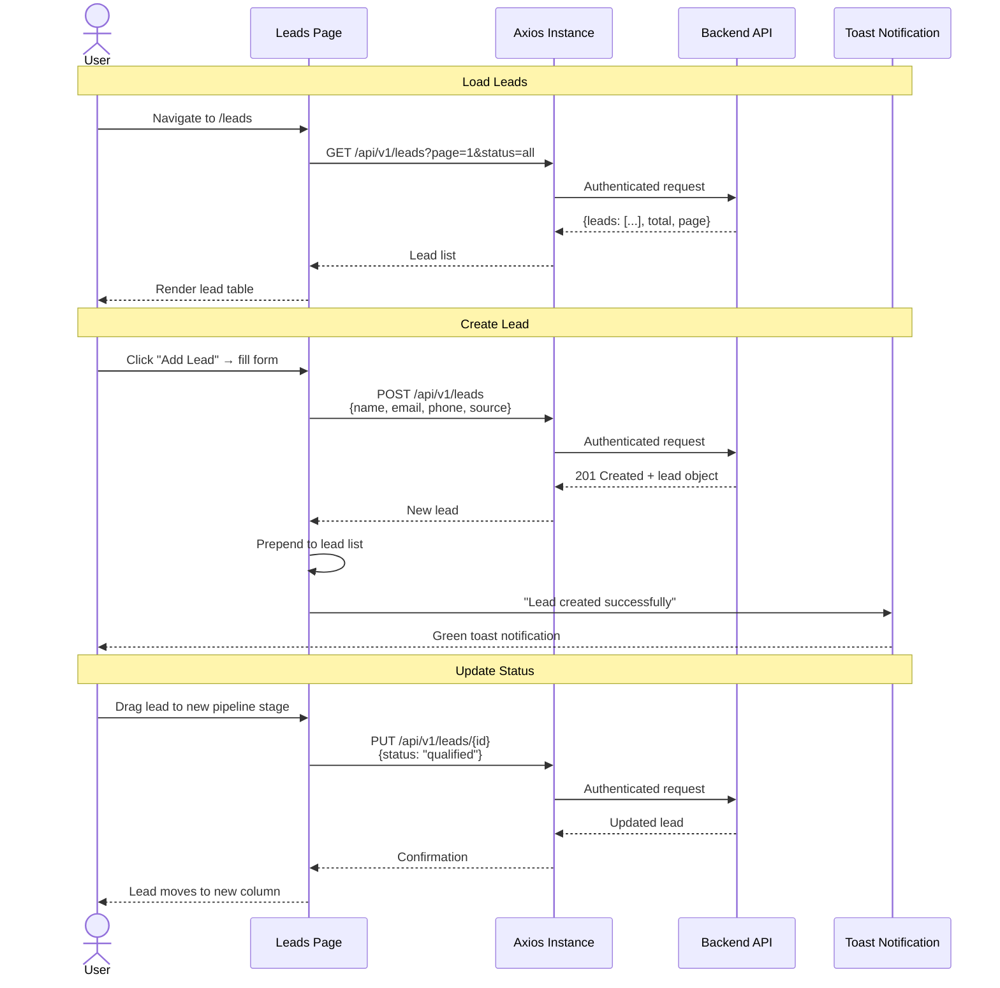
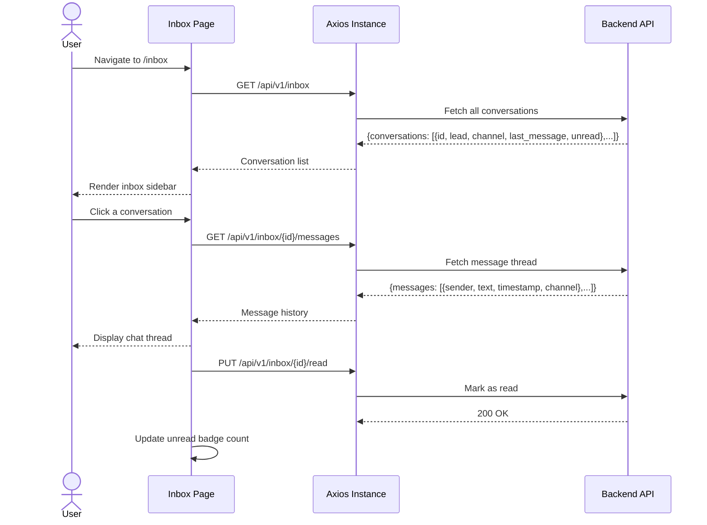
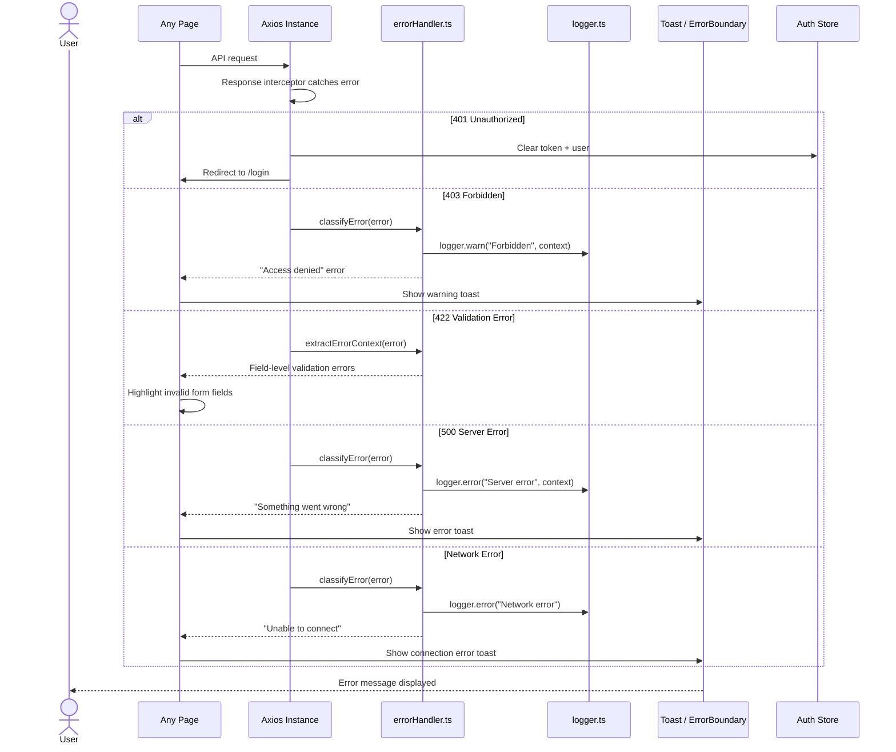
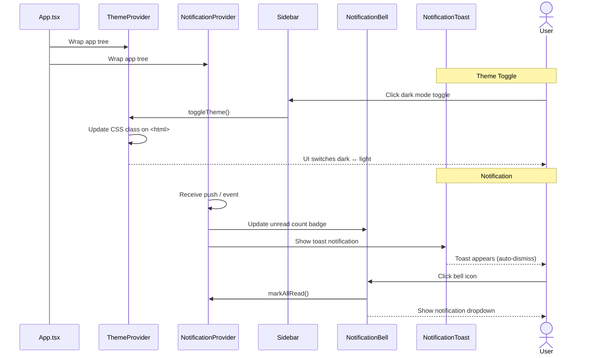

# Frontend — Sequence Diagrams

All diagrams use [Mermaid](https://mermaid.js.org/) syntax and render natively on GitHub.

---

## 1. Application Bootstrap & Routing

---

## 2. Login Flow

---

## 3. Dashboard Data Loading

---

## 4. AI Agent Chat Interaction

---

## 5. Ad Copy Generation (Marketing Agent)

---

## 6. Lead Management Flow

---

## 7. Unified Inbox Flow

---

## 8. Error Handling Flow

---

## 9. Theme & Notification Context Flow

